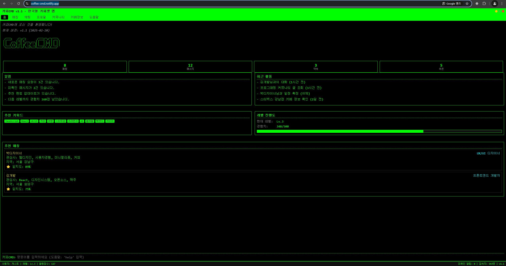

# 커피CMD - 한국형 커피챗 앱 💻☕


## 📝 프로젝트 소개

**커피CMD**는 명령 프롬프트(CMD) 스타일 인터페이스를 가진 독특하고 혁신적인 한국형 커피챗 앱입니다. 개발자, 디자이너, 기획자, 마케터 등 다양한 직군의 전문가들이 서로 만나고 네트워킹할 수 있는 플랫폼을 제공합니다.

레트로한 CLI 스타일의 인터페이스는 IT 종사자들에게 친숙한 환경을 제공하며, 커맨드 라인을 통해 다양한 기능에 빠르게 접근할 수 있습니다.

💻 **프로토타입 배포**: [커피CMD 바로가기](https://coffee-cmd.netlify.app/)

## ✨ 주요 기능

### 🤝 매칭 시스템

- 관심사/직업 기반 지능형 매칭
- 지역 기반 매칭(서울 강남, 홍대, 판교 등)
- 매칭 상태 관리 및 일정 조율
- 경험/관심사에 기반한 매칭 상대 추천

### 💬 채팅 기능

- 사용자 간 실시간 메시지 교환
- 한국형 텍스트 이모티콘 지원 (ㅋㅋㅋ, ㅎㅎㅎ, ㅠㅠ 등)
- 채팅 저장 및 내보내기
- 일정 조율 및 미팅 설정

### 👤 프로필 관리

- 세부적인 사용자 프로필 설정
- 직업/관심사 세분화
- 경험치 및 레벨 시스템
- 성취 뱃지 시스템

### 📋 커뮤니티 기능

- 직군별 게시판
- Q&A 섹션
- 커피챗 성공 사례 공유
- 관심사 기반 토픽 토론

### ☕ 카페 정보

- 미팅하기 좋은 카페 추천
- 지역별/특성별 카페 검색
- 카페 프로모션 정보
- 카페 리뷰 및 평점

## 🚀 사용 방법

```
$ 매치 [키워드]   // 특정 키워드로 매칭 상대 검색
$ 채팅 [ID]      // 특정 사용자와 채팅 시작
$ 일정 [ID]      // 특정 사용자와 일정 잡기
$ 검색 [키워드]   // 검색 기능
$ 도움말         // 명령어 안내
```

## 🛠️ 기술 스택

### 🖥️ 프론트엔드

- **HTML, CSS, JavaScript (Vanilla)**
- **레이아웃**: Flexbox, Grid
- **반응형 디자인**: 모바일 및 데스크톱 지원
- **폰트**: D2Coding(한글 코딩 폰트)

### 🖥️ 백엔드

- 미정

## 📂 프로젝트 구조

```
/
├── css/
│   ├── style.css        # 기본 스타일
│   └── terminal.css     # 터미널 관련 스타일
├── js/
│   └── main.js          # 메인 자바스크립트
├── pages/
│   ├── home.html        # 홈 화면
│   ├── matches.html     # 매칭 관리
│   ├── chat.html        # 채팅 화면
│   ├── profile.html     # 프로필 관리
│   ├── community.html   # 커뮤니티
│   ├── cafes.html       # 카페 정보
│   └── help.html        # 도움말
└── index.html           # 메인 페이지
```

## 📱 스크린샷



## 🔮 향후 개발 계획

### 1차 개발 (현재)

- ✅ 기본 UI/UX 구현
- ✅ 메인 기능 프론트엔드 프로토타입 개발
- ✅ 모든 페이지에서 CLI 작동 구현

### 2차 개발 (예정)

- 🔲 백엔드 시스템 구축 (기술 스택 미정)
- 🔲 사용자 인증 시스템 개발
- 🔲 실시간 채팅 구현
- 🔲 알림 시스템 구축

### 3차 개발 (예정)

- 🔲 매칭 알고리즘 고도화
- 🔲 지도 API 연동 (카페 정보)
- 🔲 모바일 앱 개발 (React Native)
- 🔲 PWA 지원 추가

### 4차 개발 (장기)

- 🔲 AI 기반 매칭 시스템
- 🔲 음성 채팅 지원
- 🔲 화상 미팅 기능
- 🔲 글로벌 서비스 확장

## 🔧 설치 및 실행

1. 저장소 클론

```bash
git clone https://github.com/yourusername/coffee-cmd.git
cd coffee-cmd
```

2. 웹 서버로 실행

```bash
# Python 3을 사용하는 경우
python -m http.server 8000

# Python 2를 사용하는 경우
python -m SimpleHTTPServer 8000
```

3. 브라우저에서 열기

```
http://localhost:8000
```
